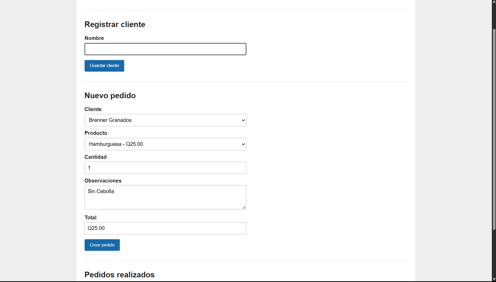
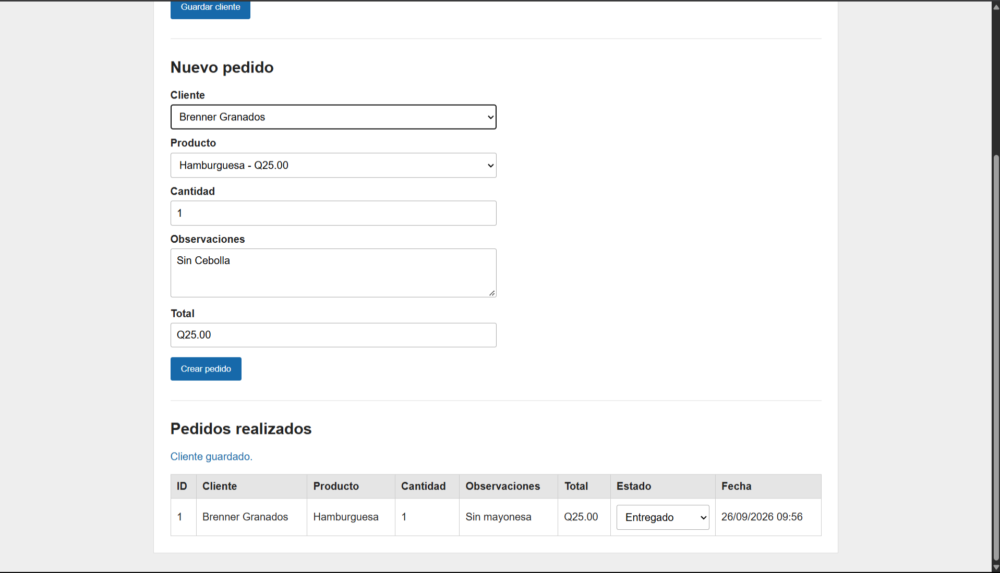
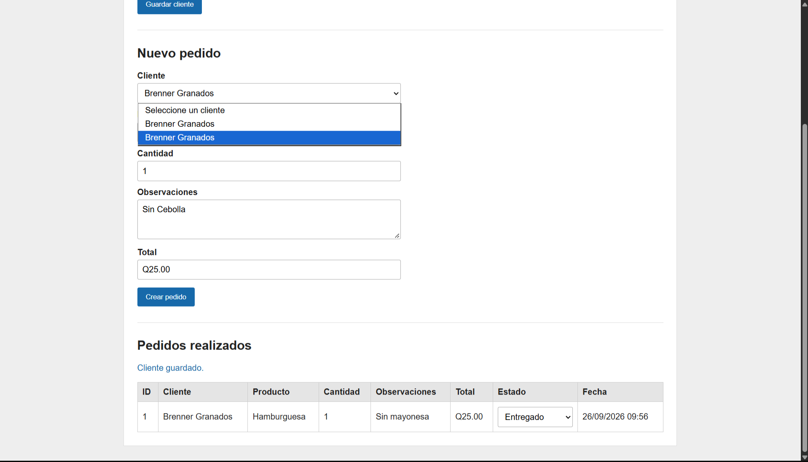
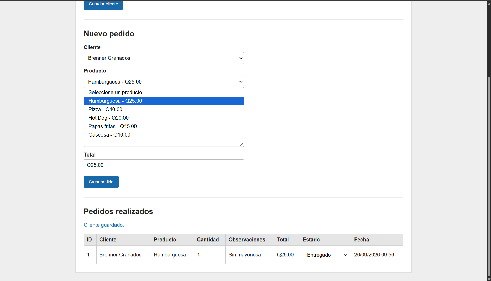
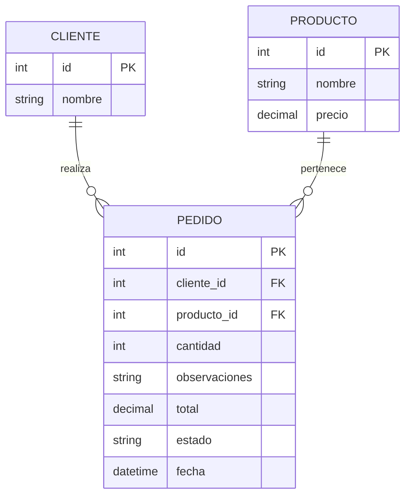
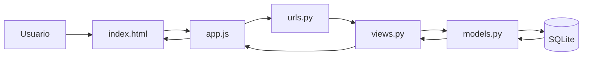

# Pedidos de comida

Aplicación web sencilla desarrollada con **Django** para registrar clientes y gestionar pedidos de comida.

El proyecto fue realizado como una práctica web y utiliza una estructura simple: Django como backend, SQLite como base de datos y HTML, CSS y JavaScript vanilla para la interfaz.

## Funcionalidades

- Registrar clientes.
- Consultar clientes registrados.
- Seleccionar un producto del menú.
- Indicar cantidad.
- Agregar observaciones al pedido.
- Calcular automáticamente el total.
- Registrar pedidos.
- Consultar pedidos realizados.
- Cambiar el estado del pedido entre:
  - Recibido
  - Preparando
  - Entregado

> **Alcance actual:** cada pedido registra un solo producto, pero permite indicar varias unidades mediante el campo `cantidad`.

---

## Tecnologías utilizadas

- Python
- Django
- SQLite
- HTML
- CSS
- JavaScript

---

## Capturas de la aplicación

### 1. Registro de cliente y creación de pedido

En esta pantalla se registra un cliente y posteriormente se utiliza para crear un pedido.



### 2. Pedido registrado

Después de crear el pedido, este aparece en la tabla de pedidos realizados con su cliente, producto, cantidad, observaciones, total, estado y fecha.



### 3. Selección de cliente

Los clientes registrados son cargados en el selector para poder asociarlos a un nuevo pedido.



### 4. Selección de producto

Los productos precargados aparecen junto con su precio. Al seleccionar uno y cambiar la cantidad, el sistema calcula el total.



---

## Modelos y tablas

| Modelo | Datos principales | Función |
|---|---|---|
| `Cliente` | `id`, `nombre` | Guarda los clientes registrados. |
| `Producto` | `id`, `nombre`, `precio` | Guarda el menú de productos y sus precios. |
| `Pedido` | `cliente`, `producto`, `cantidad`, `observaciones`, `total`, `estado`, `fecha` | Guarda cada pedido realizado. |

En SQLite, Django normalmente crea estas tablas utilizando el nombre de la aplicación y el modelo:

```text
pedidos_cliente
pedidos_producto
pedidos_pedido
```

---

## Relación entre las tablas



Un cliente puede realizar varios pedidos y un producto puede aparecer en varios pedidos.

---

## API y tablas afectadas

| Método | Endpoint | Acción | Modelo / tabla afectada |
|---|---|---|---|
| `GET` | `/api/clientes/` | Consulta los clientes registrados. | `Cliente` / `pedidos_cliente` |
| `POST` | `/api/clientes/` | Registra un nuevo cliente. | `Cliente` / `pedidos_cliente` |
| `GET` | `/api/productos/` | Consulta los productos disponibles. | `Producto` / `pedidos_producto` |
| `GET` | `/api/pedidos/` | Consulta los pedidos realizados. | `Pedido`, `Cliente`, `Producto` |
| `POST` | `/api/pedidos/` | Crea un pedido y calcula su total. | `Pedido` / `pedidos_pedido` |
| `POST` | `/api/pedidos/<id>/estado/` | Actualiza el estado de un pedido. | `Pedido` / `pedidos_pedido` |

---

## Flujo de funcionamiento



Ejemplo al crear un pedido:

1. El usuario selecciona un cliente y un producto.
2. Indica la cantidad y las observaciones.
3. JavaScript envía los datos al endpoint de pedidos.
4. Django recibe la solicitud en `views.py`.
5. Se consulta el cliente y el producto.
6. El servidor calcula `precio × cantidad`.
7. Se crea el registro en `Pedido`.
8. El pedido se muestra en la tabla de la interfaz.

---

## Archivos principales

| Archivo | Función |
|---|---|
| `manage.py` | Ejecuta comandos de Django. |
| `pedidos/models.py` | Define los modelos `Cliente`, `Producto` y `Pedido`. |
| `pedidos/views.py` | Contiene la lógica de la pantalla y los endpoints JSON. |
| `pedidos/urls.py` | Relaciona las rutas de la aplicación con sus vistas. |
| `pedidos/templates/pedidos/index.html` | Contiene los formularios y la tabla de pedidos. |
| `pedidos/static/pedidos/app.js` | Consume la API y actualiza la interfaz. |
| `pedidos/static/pedidos/style.css` | Contiene los estilos visuales. |
| `pedidos/migrations/0002_productos_iniciales.py` | Inserta los productos iniciales. |
| `pedidos_comida/settings.py` | Configura Django, SQLite, idioma y zona horaria. |
| `requirements.txt` | Contiene las dependencias del proyecto. |

---

## Productos iniciales

| Producto | Precio |
|---|---:|
| Hamburguesa | Q25.00 |
| Pizza | Q40.00 |
| Hot Dog | Q20.00 |
| Papas fritas | Q15.00 |
| Gaseosa | Q10.00 |

---

## Instalación

Clonar el repositorio:

```bash
git clone URL_DEL_REPOSITORIO
cd "EJERCICIO SEMINARIO"
```

Crear el entorno virtual:

```bash
python -m venv .venv
```

Activar el entorno en PowerShell:

```powershell
.\.venv\Scripts\Activate.ps1
```

Instalar las dependencias:

```bash
pip install -r requirements.txt
```

Ejecutar las migraciones:

```bash
python manage.py migrate
```

---

## Ejecución

Iniciar el servidor:

```bash
python manage.py runserver
```

Abrir en el navegador:

```text
http://127.0.0.1:8000/
```

---

## Estructura principal

```text
EJERCICIO SEMINARIO/
├── manage.py
├── requirements.txt
├── db.sqlite3
├── pedidos_comida/
│   ├── settings.py
│   └── urls.py
├── pedidos/
│   ├── migrations/
│   ├── templates/
│   │   └── pedidos/
│   │       └── index.html
│   ├── static/
│   │   └── pedidos/
│   │       ├── app.js
│   │       └── style.css
│   ├── models.py
│   ├── views.py
│   └── urls.py
└── docs/
    └── img/
        ├── 01-formulario-pedido.png
        ├── 02-pedido-registrado.png
        ├── 03-seleccion-cliente.png
        └── 04-seleccion-producto.png
```

## Autor

Proyecto realizado como ejercicio práctico de desarrollo web.
